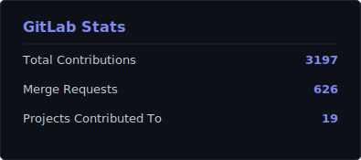
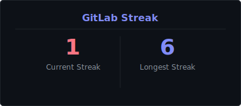
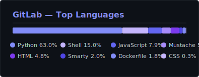

 

&nbsp;
&nbsp;
&nbsp;

  

 

## About Me

I'm a passionate **Full Stack Developer** from **Pune, Maharashtra**, dedicated to building scalable, high-performance web applications. I enjoy solving complex problems and turning ideas into reality through elegant code.

- Currently open to **new opportunities and collaborations**
- Exploring **Machine Learning**, **Satellite Image Classification**, and **ETL Pipelines**
- On GitHub since **2018** with **29+ public repositories**
- Check out my portfolio: **[ankitgupta2001.github.io](https://ankitgupta2001.github.io)**

 

## Tech Stack

<table>
<tr>
<td align="center" width="25%">

**Frontend**

 

</td>
<td align="center" width="25%">

**Backend**

 

</td>
<td align="center" width="25%">

**Database & Cloud**

 

</td>
<td align="center" width="25%">

**Tools**

 

</td>
</tr>
</table>

 

## Featured Projects

<table>
<tr>
<td width="50%">

### [Satellite Image Classification](https://github.com/ankitgupta2001/Satellite-Image-Classification)
Deep learning project for classifying satellite imagery using ML techniques and Jupyter Notebooks.

`Jupyter Notebook` `Python` `Machine Learning`

</td>
<td width="50%">

### [Database Migration](https://github.com/ankitgupta2001/Database_Migration)
Python-based mini ETL pipeline for MySQL database migration with seamless data transfer and transformation.

`Python` `MySQL` `ETL`

</td>
</tr>
<tr>
<td width="50%">

### [BenToPDF](https://github.com/ankitgupta2001/bentopdf)
A TypeScript utility for converting and generating PDF documents with a clean, developer-friendly API.

`TypeScript` `PDF`

</td>
<td width="50%">

### [ChatterFlux](https://github.com/ankitgupta2001/ChatterFlux)
Real-time chat application built with modern web technologies for seamless communication.

`Real-time` `WebSockets`

</td>
</tr>
<tr>
<td width="50%">

### [Post Graduation Research](https://github.com/ankitgupta2001/Post_Graduation--Research)
Academic research work featuring data analysis and ML models from post-graduation studies.

`Jupyter Notebook` `Research` `Data Analysis`

</td>
<td width="50%">

### [More Projects &rarr;](https://github.com/ankitgupta2001?tab=repositories)
Explore all **29 public repositories** including tools, experiments, and open source contributions.

`Open Source` `29+ Repos`

</td>
</tr>
</table>

 

## My Contributions

&nbsp;&nbsp;&nbsp;&nbsp;&nbsp;&nbsp;&nbsp;&nbsp;&nbsp;&nbsp;&nbsp;&nbsp;&nbsp;&nbsp;&nbsp;&nbsp;&nbsp;&nbsp;&nbsp;&nbsp;&nbsp;&nbsp;&nbsp;&nbsp;&nbsp;&nbsp;&nbsp;&nbsp;&nbsp;&nbsp;&nbsp;&nbsp;&nbsp;&nbsp;&nbsp;&nbsp;&nbsp;&nbsp;&nbsp;&nbsp;&nbsp;&nbsp;&nbsp;&nbsp;&nbsp;&nbsp;&nbsp;&nbsp;&nbsp;&nbsp;&nbsp;&nbsp;&nbsp;&nbsp;&nbsp;&nbsp;&nbsp;&nbsp;&nbsp;&nbsp;&nbsp;&nbsp;&nbsp;&nbsp;&nbsp;&nbsp;&nbsp;&nbsp;&nbsp;&nbsp;&nbsp;&nbsp;&nbsp;&nbsp;&nbsp;&nbsp;&nbsp;&nbsp;&nbsp;&nbsp;

 

  

 

## Let's Connect

I'm always open to interesting conversations and collaboration opportunities.

  

&nbsp;
&nbsp;

  

